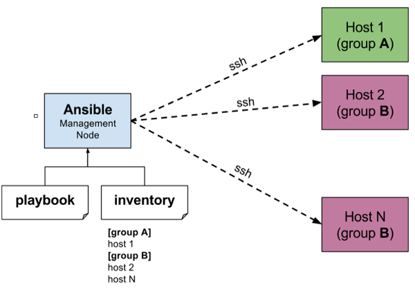

# Einstieg in Ansible


---

## Was ist Ansible

- Ansible ist ein mächtiges Tool für **Configuration Management**.
  - Es ermöglicht die Automatisierung und Verwaltung von Systemkonfigurationen.

---

## Was ist Configuration Management?

- Wesentlicher Bestandteil der IT-Infrastrukturverwaltung.
- Es bezieht sich auf die Automatisierung und systematische Verwaltung von Konfigurationen auf verschiedenen IT-Systemen.
- Dazu gehören Server, Netzwerke, Anwendungen und mehr.

---

### Wieso braucht man Configuration Management?

---

#### Aufsetzen von Systemen

- Bei der Einrichtung von Systemen gibt es verschiedene Ansätze:
  - Manuelle Installation: Zeitaufwändig und fehleranfällig.
  - Bash Script: Bietet Automatisierung, kann jedoch komplex werden.
  - **Configuration Management**: Bietet eine strukturierte und automatisierte Möglichkeit, Systeme einzurichten.

---

#### Maintenance

- Die Wartung von Systemen umfasst Aktualisierungen, Sicherheitspatches und den Umgang mit den Lebenszyklen der Systeme.
- Configuration Management hilft bei der automatisierten Aktualisierung und Wartung.

---

### Agent vs Agentless?

---

#### Was ist ein Agent?

- Ein Agent ist eine Softwarekomponente, die auf den Zielsystemen installiert wird. Sie kommuniziert mit einem zentralen Server, um Konfigurationsänderungen durchzuführen und Statusinformationen zu sammeln.

---

#### Ansible: Commands über SSH

- Ansible ist ein agentenloses Configuration-Management-Tool. Es verwendet SSH, um Befehle und Konfigurationen auf den Zielsystemen auszuführen. Dadurch wird die Notwendigkeit der Installation von Agenten auf den Systemen vermieden.

---

## Ansible: Universelles Tool



---

### Features

- Ansible zeichnet sich durch mehrere bemerkenswerte Features aus, darunter:
  - **Einfach zu erlernen und zu verwenden**: Ansible verwendet eine klare und verständliche YAML-Syntax.
  - **Open Source und plattformübergreifend**: Du kannst Ansible auf verschiedenen Betriebssystemen und Plattformen verwenden.
  - Agentless: Keine Notwendigkeit zur Installation von Agenten auf den Zielsystemen.
  - **Skalierbar und effizient**: Ansible kann in kleinen und großen Umgebungen eingesetzt werden.
  - **Unterstützt verschiedene Cloud-Plattformen**: Es kann mit Cloud-Diensten wie AWS, Azure und Google Cloud integriert werden.

---

### Syntax: YAML

- Ansible verwendet YAML (YAML Ain't Markup Language) zur Definition von Aufgaben und Konfigurationen. YAML ist einfach zu lesen und zu schreiben.

---

### Konzepte

In Ansible gibt es wichtige Konzepte, die du verstehen solltest:


---

#### Inventory

Das Inventory in Ansible ist eine Liste der verwalteten Hosts. Dieses Inventar enthält Informationen über die Hosts, auf denen Ansible Aufgaben ausführt. Hier ist ein einfaches Beispiel für ein Ansible Inventory in YAML-Format:

```yaml
# inventory.yml
webserver:
  hosts:
    web01:
      ansible_host: 192.168.1.101
    web02:
      ansible_host: 192.168.1.102
  vars:
    web_port: 80
```

In diesem Beispiel haben wir ein Inventar mit zwei Webservern (web01 und web02) und einer Variable für den Web-Port definiert.

---

#### Tasks

Tasks sind die grundlegenden Aufgaben, die auf den Hosts ausgeführt werden.
Hier ist ein Beispiel für eine einfache Ansible-Task-Definition in einem Playbook:

```yaml
# playbook.yml
- name: Install Apache
  hosts: webserver
  tasks:
    - name: Install Apache Web Server
      become: yes # Nutze sudo power
      apt:
        name: apache2
        state: present
```

In diesem Beispiel wird die Task "Install Apache" auf den Hosts in der Gruppe "webserver" ausgeführt, um den Apache Web Server zu installieren.

---

#### Recipe

Ein Recipe in Ansible ist eine Gruppe von Aufgaben, die zusammengehören und ein bestimmtes Ziel erfüllen. Hier ist ein Beispiel für ein Recipe in einem Playbook:

```yaml
# playbook.yml
- name: Configure Web Servers
  hosts: webserver
  tasks:
    - name: Install Apache
      become: yes
      apt:
        name: apache2
        state: present
    - name: Configure Virtual Host
      template:
        src: templates/vhost.conf.j2
        dest: /etc/apache2/sites-available/myapp.conf
      notify: Restart Apache
```

---

#### Playbook

Ein Playbook in Ansible ist eine Sammlung von Rezepten und Aufgaben, die eine komplexe Aufgabe oder ein Projekt beschreiben. Hier ist ein einfaches Beispiel für ein Playbook:

```yaml
# playbook.yml
- name: Web Server Configuration
  hosts: webserver
  tasks:
    - name: Install Apache
      become: yes
      apt:
        name: apache2
        state: present
```

---

In diesem Beispiel haben wir ein Playbook mit einer Aufgabe (Install Apache) und einer Rolle (common) definiert, die auf den Hosts in der Gruppe "webserver" ausgeführt werden.

#### Weitere

In Ansible gibt es noch weitere wichtige Konzepte, die die Organisierung und Wartung erleichtern:

##### Roles

Roles sind wiederverwendbare Aufgaben- und Konfigurationsstrukturen. Sie ermöglichen die Strukturierung von Playbooks und die Trennung von Aufgaben. Hier ist ein einfaches Beispiel für die Verwendung einer Rolle in einem Playbook:


##### Modules

Modules sind wiederverwendbare Funktionen für Aufgaben. Sie decken eine Vielzahl von Aufgaben ab, z.B. das Installieren von Software oder das Konfigurieren von Netzwerken. Hier ist ein Beispiel für die Verwendung eines Ansible-Moduls:

---

### Group

Die Gruppierung von Hosts in Ansible ermöglicht die einfachere Verwaltung und Ausführung von Aufgaben auf verschiedenen Hosts. Hier ist ein einfaches Beispiel für die Definition einer Host-Gruppe in einem Inventory:

```yaml
# inventory.yml
webserver:
  hosts:
    web01:
      ansible_host: 192.168.1.101
    web02:
      ansible_host: 192.168.1.102
```

In diesem Beispiel haben wir die Hosts "web01" und "web02" in der Gruppe "webserver" organisiert.

---

### Beispiel

- Konfiguation eines Webservers:
    - User / Gruppen Management
    - Installation der verwendeten Pakete (nginx, certbot, ...)
    - System Update + Instandhaltung

---

### Ähnliche Tools

- Neben Ansible gibt es andere Configuration-Management-Tools, die ähnliche Aufgaben erfüllen, darunter:
  - Chef
  - Puppet
- Beachte, dass einige Funktionen dieser Tools auch mit Terraform, einem Infrastrukturverwaltungstool, überlappen können.

---

## Praxis!
