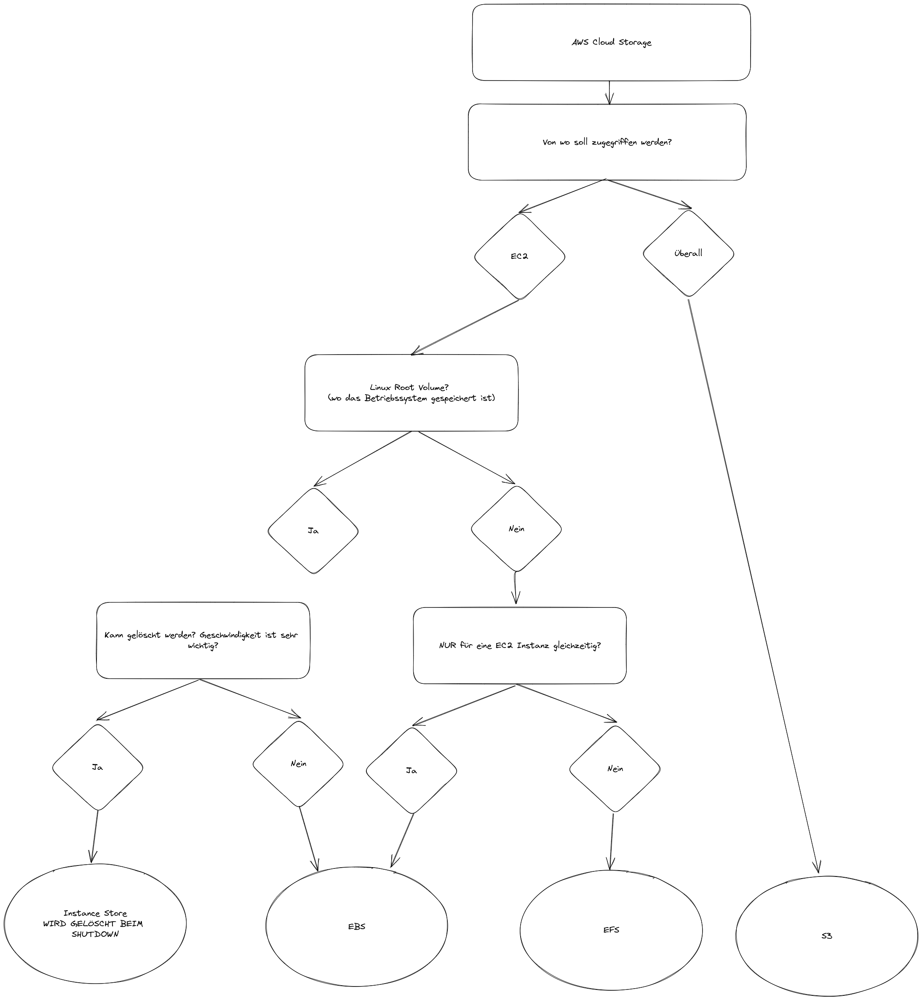

# Cloud Storage AWS

## Inhalt

- Was ist Cloud Storage?
- Unterschied Datenbanken und Cloud Storage
- Was für Storage Typen gibt es in der AWS Cloud?:
  - Object Storage
  - Block Storage
  - File Storage
- Welche Storage Angebote gibt es in der AWS Cloud?
- Wann sollte was verwendet werden?

## Was ist Cloud Storage?

Unter Cloud Storage versteht man die Speicherung von Daten in der Cloud. Die Daten werden dabei in einem oder mehreren Rechenzentren gespeichert.

## Unterschied Datenbanken und Cloud Storage

1. **Datenbanken**:

- Organisierte Sammlungen von Daten auf Servern
- Verwendet für Speicherung, Verwaltung und Abfrage von strukturierten oder unstrukturierten Daten.
- Bieten Funktionen wie Datenintegrität, Transaktionsunterstützung und Abfrageoptimierung
- Meistens für eine Anwendung!

2. **Cloud Storage**:

- Primär für Speicherung und Bereitstellung von Dateien und Objekten in der Cloud. Bieten skalierbaren, dauerhaften Speicherplatz und ermöglichen Zugriff über das Internet
- Weniger erweiterte Funktionen für Datenverwaltung im Vergleich zu Datenbanken, jedoch oft schneller und flexibler bei Speicherkapazität und Dateizugriff.
- Kann für verschiedene Bereiche verwendet werden, z.B. EC2 Root device, Backup, Archivierung, Disaster Recovery, Content Delivery, Big Data Analytics, etc.

## Was für Storage Typen gibt es in der AWS Cloud?

Es gibt verschiedene Storage Typen in der AWS Cloud. Diese unterscheiden sich in der Art der Speicherung und der Zugriffsmöglichkeit.

### Object Storage

Ist ein modernes System, wobei die Daten in Form von Objekten gespeichert werden. Jedes Objekt besteht aus Daten, Metadaten und einem eindeutigen Identifikator. Die Objekte werden in einem flachen Adressraum gespeichert. Das heisst, dass die Objekte nicht in einer Verzeichnisstruktur gespeichert werden, sondern in "alle in dem gleichen Ordner". Die Objekte können über einen eindeutigen Identifikator angesprochen werden.

Der wichtigste Vertreter ist **Amazon S3**.  
Auch wenn es in der Konsole so aussieht, als wären die Objekte (Dateien) in Ordnern gespeichert. Das ist nicht der Fall. Alle Objekte sind in der gleichen Ebene, haben aber einen eindeutigen Identifikator. Dieser Identifikator ist der Pfad, der in der Konsole angezeigt wird.

#### Wichtigste Eigenschaften

- **Kann nicht als Root Device für EC2 Instanzen verwendet werden, d.h. kann nicht**
- Kann nicht als Linux volume gemounted werden (nur über File Gateway / S3FS -> Für die Prüfung nicht relevant)
- Wird über S3 API angesprochen (Beim verwenden der AWS CLI, wird auch die S3 API verwendet)
- Langsamer als andere Typen (EBS, EFS)
- Einfach zu skalieren
- Günstig
- High Availability, Durability, Security

### Block Storage

Kann mit einer Festplatte verglichen werden. Die Daten werden in Blöcken gespeichert. Die Blöcke werden über einen eindeutigen Identifikator angesprochen. Die Blöcke können in einer Verzeichnisstruktur gespeichert werden.
Das hat den Vorteil, dass dafür verschiedene räumlich getrennte Speichermedien verwendet werden können und somit leichter skaliert werden kann.
Es wird häufig als Root Device für EC2 Instanzen verwendet.

Der wichtigste Vertreter ist **Amazon EBS**.

#### Wichtigste Eigenschaften

- Kann als Root Device für EC2 Instanzen verwendet werden
- Kann als Linux volume gemounted werden
- Muss erst mit einer EC2 Instanz verbunden werden und dann gemounted werden
- Immer in einer AZ
- Schneller als andere Typen (S3, EFS)
- Skalieren möglich, aber nicht so einfach wie bei S3
- Teuer aber günstiger als EFS
- *Nur eine Verbindung möglich (nicht wie bei S3, wo mehrere Verbindungen möglich sind)* -> Stimmt eigentlich nicht zu 100% aber kann in der Prüfung dran kommen

### File Storage

Kann mit einem Netzlaufwerk (NAS) verglichen werden. Die Daten werden in Ordnern gespeichert und können von mehreren Clients gleichzeitig aufgerufen werden. Durch die Standard File Struktur, kann es leicht in Linux Systemen gemounted werden.
Ist ideal für Daten, die in verschiedenen Instanzen gleichzeitig verwendet werden sollen.

Der wichtigste Vertreter ist **Amazon EFS**.

#### Wichtigste Eigenschaften

- POSIX kompatibel
- Kann als Linux volume gemounted werden
- Kann von mehreren Instanzen gleichzeitig verwendet werden
- Kann in mehreren AZs gespeichert werden
- Schneller als S3 aber langsamer als EFS
- Skalieren möglich, aber nicht so einfach wie bei S3
- Teuer

## Welche Storage Angebote gibt es in der AWS Cloud?

- **Amazon S3**:
  - Object Storage
  - Einfach zu skalieren
  - Günstig
  - High Availability, Durability, Security
- **Amazon EBS**:
  - Block Storage
  - Root Device für EC2 Instanzen ("Festplatte")
  - Immer in einer AZ
  - Skalieren möglich, aber nicht so einfach wie bei S3
- **Amazon EFS**:
  - File Storage
  - Wie NAS
  - Teuer
- **EC2 Instance Store**:
  - Block Storage
  - Temporärer Speicher
  - Nur für Instanzen
  - Nur in einer AZ
  - Schnell
  - Günstig
  - Keine Sicherung
  - Keine Snapshot
  - Keine High Availability
  - Keine Durability
  - Keine Security

## Wann sollte was verwendet werden?

### Root device für EC2 Instanzen

Das Root device einer EC2 Instanz ist die Festplatte, auf der das Betriebssystem installiert ist. Hierfür wird ein Block Storage verwendet.
-> **Amazon EBS**

### Daten die von mehreren Instanzen gleichzeitig verwendet werden sollen

Dafür sollte ein FIle Storage verwendet werden. -> **Amazon EFS**
Es kann auch ein Object Storage verwendet werden, jedoch ist es hier nicht möglich, die Daten als Volume zu mounten! -> **Amazon S3**

### Benutzerdaten in einer Applikation hochverfügbar und sicher speichern

Dafür sollte ein Object Storage verwendet werden, da die Daten hochverfügbar sind und einfach über die S3 API abgerufen werden können. -> **Amazon S3**

## Decision Tree

      
