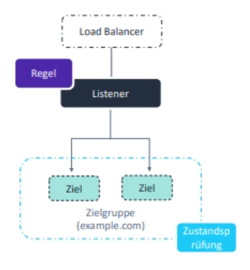
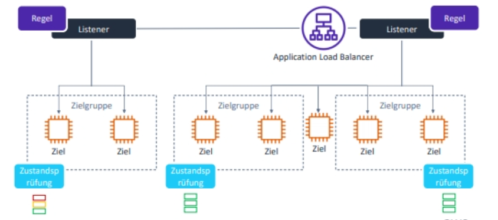
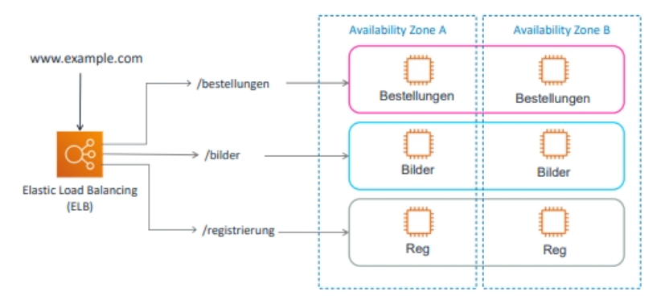

# Elastic Load Balancer Listener

## Inhalt

- Was ist ein ELB Listener?
- Was ist der Zweck eines Listeners / einer Zielgruppe?
- Befehle in der AWS CLI

## Was ist ein ELB Listener?

- Prozess, der den Port und das Protokoll definiert, die vom Load Balancer überwacht werden
- Jeder Load Balancer benötigt mindestens einen Listener, um Datenverkehr zu akzeptieren
- Bis zu 50 Listener pro Load Balancer
- Routing Regeln sind für Listener definiert



### Beispiel



- Beispiel zeigt eine Infrastruktur mit einem ALB
- ALB kann mehrere Listener haben (2 im Bsp)
- Listener leitet Anfragen basierend auf definierten Regeln an eine oder mehrere Zielgruppe weiter

### Rules / Regeln

- Jede Regel gibt folgendes an:
  - Zielgruppe (z.B. EC2 Autoscaling Group)
  - Bedingung
  - Priorität
- Es muss eine Standardregel definiert werden
- Weitere Regeln können definiert werden um verschiedene Requests unterschiedlichen Zielgruppen zuzuweisen
-> **Inhaltsbasiertes Routing**

### Zielgruppen

- Gruppe registrierter Ziele:
  - EC2 Instances
  - Container Instances *Amazon Elastic Container Service* (ECS)
- Ein einzelnes Ziel kann für mehrere Zielgruppen verwendet werden

#### Beispiel Zielgruppen / Regeln



## AWS CLI

- Es ist wichtig, dass immer die entsprechenden ARNs notiert werden und in den folgenden Commands eingesetzt werden
- Mehr inforamtionen gibt es [hier](https://docs.aws.amazon.com/elasticloadbalancing/latest/application/tutorial-application-load-balancer-cli.html)

### ALB erstellen

```console
aws elbv2 create-load-balancer \
    --name my-load-balancer  \
    --subnets subnet-0e3f5cac72EXAMPLE subnet-081ec835f3EXAMPLE \
    --security-groups sg-07e8ffd50fEXAMPLE
```

### Target Group (Zielgruppe) erstellen

```console
aws elbv2 create-target-group \
    --name my-targets \
    --protocol HTTP \
    --port 80 \
    --vpc-id vpc-0598c7d356EXAMPLE \
    --ip-address-type ipv4
```

### Targets registrieren

```console
aws elbv2 register-targets \
    --target-group-arn targetgroup-arn  \
    --targets Id=i-0abcdef1234567890 Id=i-1234567890abcdef0
```

### Listener erzeugen

```console
aws elbv2 create-listener \
    --load-balancer-arn loadbalancer-arn \
    --protocol HTTP \
    --port 80  \
    --default-actions Type=forward,TargetGroupArn=targetgroup-arn
```
