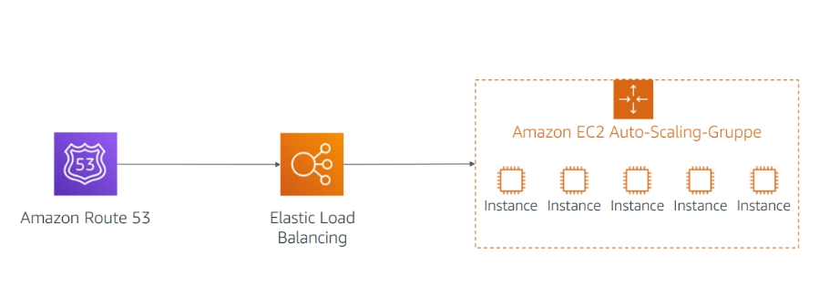

# Namensauflösung / Skalierung

## Inhalt

- Was ist ein Elastic Load Balancer?
- Welche Typen gibt es?
- Was ist eine Auto Scaling Gruppe?
- Was ist eine Skalierungspolitik?

## Skalierung nach Bedarf / Auto Scaling

- Kauf von Hardware für den kurzfristigen Bedarf führt zu Verschwendung
- Die Hardware ist nicht immer ausgelastet

## EC2 Auto-Scaling Group

- Hochskalieren bei Spitzenzeiten (scale out)
- Herunterskalieren bei geringer Auslastung (scale in)
- Ersetzen fehlerhafter Instanzen
- Nutzungsbasierte Preise

## Fragen

- Wie lautet eine Gruppe für die automatische Skalierung von EC2 Instanzen?
- Welcher Service wird verwendet um Datenverkehr auf eine Lastenverteilung zu verweisen?

## Erkenntnisse

- Durch die Skalierung in der Cloud können Ingenieure Architekturen erstellen, die bsaierend auf der Kundennachfrage automatisch wachsen und schrumpfen
- Amazon Route 53 ist ein DNS Service, der die Verwaltung von Domains und der Namensauflösung vereinfacht, vorallem wenn mehrere Regionen verwendet werden sollen
- Elastic Load Balancing bietet virtuelle Lastenverteilungen, die eingehenden Datenverkehr automatisch auf mehrere Ziele wie EC2-Instances, Container, IP-Addressen und Lambda-Funktionen verteilen
- Eine EC2 Auto Scaling Group enthält eine Sammlung von EC2 Instances, die automatisch skaliert werden und als logische Gruppe behandelt werden.
