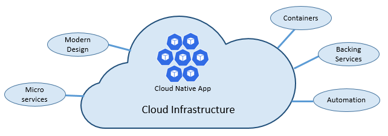
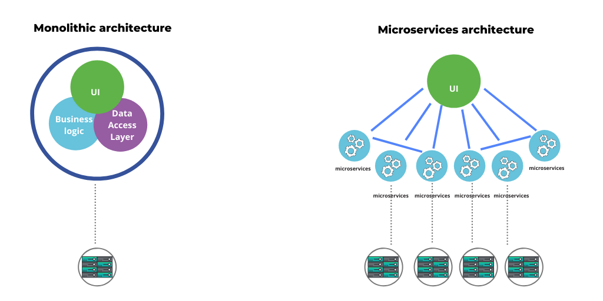
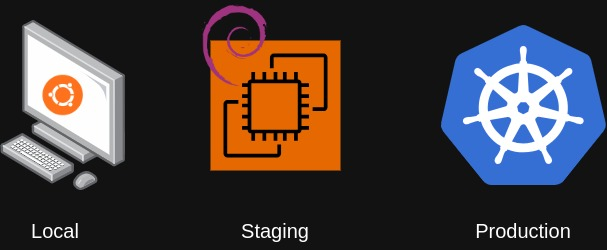
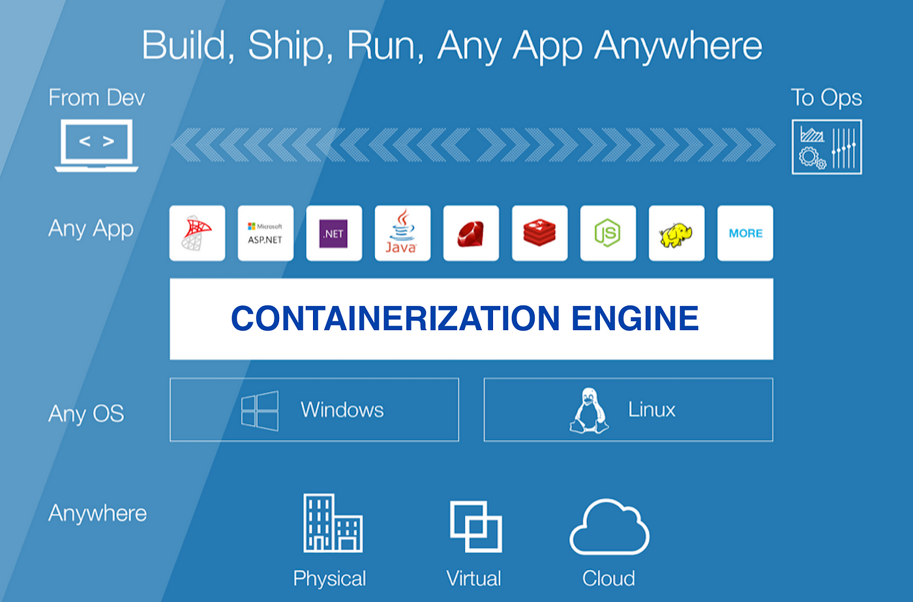
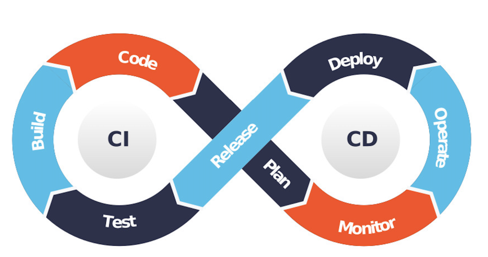
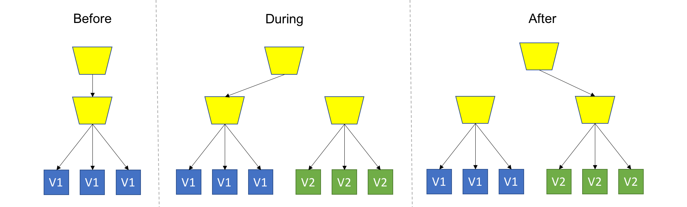

# Cloud Native Programming

---

# Agenda

1. Was ist Cloud Native Programming?

2. Microservice Architektur

3. Containerisierung

4. CI CD

---

---

# 1. Was ist Cloud Native Programming?

- **Definition von Cloud Native Programming**

    - Cloud Native Programming bezieht sich auf die Entwicklung von **Anwendungen und Services, die von Anfang an für die Cloud entwickelt** wurden.
    - Diese Anwendungen sind **agil, skalierbar** und nutzen die Ressourcen von **Public Clouds** (z.B. AWS, GCP, Azure)  effizient.

- **Unterschied zwischen herkömmlicher und Cloud Native Entwicklung**

    - In herkömmlicher Entwicklung werden Anwendungen oft für lokale Rechenzentren ("On-Premise") entwickelt, während Cloud Native Anwendungen auf Cloud-Infrastruktur zugeschnitten sind.
    - Cloud Native impliziert (meistens) **Microservices und DevOps-Praktiken**.

---

# 2. Microservice Architektur

---

## 2.1 Monolithic Architekturen

- **Was sind Monolithic Architekturen?**

    - Monolithen sind der historisch gewachsene Standard
    - Alle Komponenten der Applikation sind **in einer logischen Einheit gebündelt**

- **Vorteile und Herausforderungen von Monolithen**

    - Vorteile: Einfach und schnell zu Entwickeln, Effizienz / Geschwindigkeit
    - Herausforderungen: Schwer zu skalieren, keine Fault Tolerance

---

## 2.2 Microservice Architekturen

- **Was sind Microservices?**

    - Microservices sind **kleine, eigenständige Dienste**, die spezifische Funktionen erfüllen.
    - Sie können **unabhängig entwickelt, bereitgestellt und skaliert** werden.

- **Vorteile und Herausforderungen von Microservices**

    - Vorteile: Skalierbarkeit, Flexibilität, Wartbarkeit.
    - Herausforderungen: Komplexität, Kommunikation zwischen Diensten.

- **Beispiele für erfolgreiche Anwendungen von Microservices**

    - Netflix, Amazon, Uber und viele andere nutzen Microservices für skalierbare und zuverlässige Anwendungen.

---

# 3. Containerisierung

---

## But why?

- Unterschiedliche Environments

---

---

- **Einführung in Container und ihre Bedeutung**

    - Container sind isolierte Umgebungen,
    - die **Anwendungen und Abhängigkeiten kapseln**.
    - Sie sind leichtgewichtig und ermöglichen eine **konsistente Bereitstellung**.

- **Docker und Container-Orchestrierung (z. B. Kubernetes)**

    - **Docker** ist ein bekanntes Containerisierungstool.
    - **Kubernetes** ist eine **Orchestrierungsplattform** zur **Automatisierung der Containerbereitstellung und -verwaltung**.

- **Praktische Anwendungen von Containern**

    - Container finden Anwendung in DevOps, Bereitstellung von Anwendungen und Microservice-Architekturen.

---

# 4. Continuous Integration und Continuous Delivery/Deployment (CI/CD)

--- 

- **Was ist CI/CD**

    - CI bezieht sich auf die **kontinuierliche Integration von Codeänderungen und Tests**. (Nach jedem Commit wird automatisch ein Test ausgeführt)
    - CD umfasst die **kontinuierliche Bereitstellung von Anwendungen**. (Automatisches Deployment nach einem merge in Master)

- **Die CI/CD-Pipeline erklären**

    - Die CI/CD-Pipeline ist eine **Automatisierungskette**, die den Entwicklungs- und Bereitstellungsprozess unterstützt.
    - Nach einem Event (z.B. Commit push oder Merge) wird eine Aktion angestoßen (z.B. Build, Test,  Deployment)

---

---

- **Best Practices für CI/CD**
    
    - Schnelle Iterationszyklen (Viele kleine Features / Commits): **Ein Merge / pro Tag**
    - Testing, Testing Testing!:
        - Da bei CD automatisch deployed wird, ist es wichtig **zuverlässige Tests** zu haben
        - Wenn alle Tests erfolgreich sind, sollte die Wahrscheinlichkeit sehr hoch sein, dass eine Änderung funktioniert
        - Unit Tests, Integration Tests, End-to-end Tests, ...
    - Um eine konstante Ausführungsumbgebung zu ermöglichen werden normalerweise Container verwendet
    - Es gibt verschiedene Bereitstellungsprozesse wie z.B. **Blue-Green** Deployment, **Canary** Deployment

---

<!-- class: normal -->

---

<!-- class: invert -->
- **Tools für CI/CD**

    - Gitlab CI
    - Github Actions
    - AWS Codepipeline, CodeBuild, CodeDeploy, (CodeCommit)
    - Jenkings
    - TeamCity
