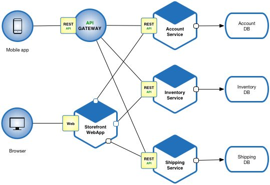

# Gruppenarbeit: Cloud Native Programming

## Szenario

Ein Startup im E-Commerce Bereich will bei der Entwicklung des Online Shops von Anfang an Wert auf eine moderne Programmierung legen und nach den Standards des Cloud Native Programming arbeiten.
Aus diesem Grund wurde unsere Consulting Agentur um Rat gefragt. Das Startup plant sich in dem stark wachsenden Markt Smartphone Markt zu etablieren und reparierte Smartphones wieder zu verkaufen.

### Anforderungen

- Prinzipien des Cloud Native Programmings werden verwendet

- **Shop**:

    - Alle verfügbaren Produkte können abgebildet werden und neue können hinzugefügt werden
    - Nutzer können sich ein Konto erstellen
    - Angemeldete Nutzer können Produkte zum Warenkorb hinzufügen
    - Der Warenkorb kan an der Kasse bezahlt werden und die Produkte werden vom Bestand entfernt
    - Produkte können bewertet werden

- **Infra**:

    - Die Anwendung kann in folgenden Umgebungen ausgeführt werden:
        - **Local** PC von Entwicklern
        - **Staging** zum Testen vor dem Deployment nach Prod (in der Cloud)
        - **Production** Haupt Deployment mit Kundendaten

## Gruppen

Für alle Architektur Diagramme, können folgende Tools verwendet werden:

- [draw.io](https://app.diagrams.net/)
- [excalidraw](https://excalidraw.com/)
- ...

### Microservice

Lest euch (bei Bedarf) folgenden Blog Artikel durch: [Link](https://hygraph.com/blog/ecommerce-microservices-architecture)

1. Identifiziert die verschiedenen Bereiche welche in Microservices aufgeteilt werden können. Erstellt eine Liste mit allen potentiellen Microservices.

2. Erstellt ein Microservice Architektur Infrastruktur Diagram, was die verwendeten Services darstellt und die Beziehung zwischen ihnen.

### Infrastruktur

1. Überlegt euch ein Konzept, wie alle Anforderungen beim verwenden einer Public Cloud erfüllt werden können. Macht euch Notizen um eure Entscheidung begründen zu können.

2. Einigt euch auf einer der Public Clouds.

3. Erstellt ein Infrastruktur Diagram, was eure gewählte Architektur darstellt. Vernachlässigt dabei, welche Microservices genau ausgeführt werden, sondern konzentriert euch darauf, wo diese ausgeführt werden (welche Tools, Services, ...)

### CI CD

Falls das Konzept noch unklar ist, lest euch folgenden Artikel durch [Link](https://www.redhat.com/en/topics/devops/what-cicd-pipelin

1. Überlegt euch ein Konzept wie man in dem genannten Projekt (sinnvoll) eine CI CD Pipeline aufbauen kann. Macht Notizen um eure Entscheidungen begründen zu können.

2. Erstellt ein Diagram, was eure gewählte Pipeline Struktur veranschaulicht und zeigt welche Schritte nach welchem Event ausgeführt werden.

### Testing

1. Welche Tests sind in diesem Projekt notwendig um eine konstante Qualität zu gewährleisten? 

2. Erstellt ein Schaubild, was zeigt wann ihr welche Tests ausführen wollt.
