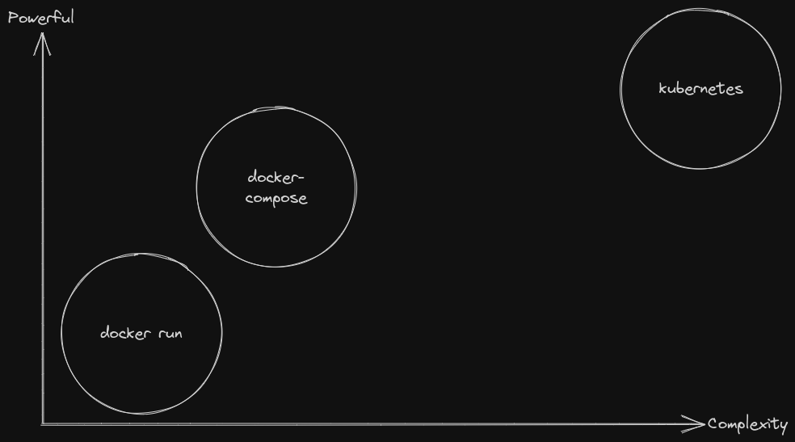
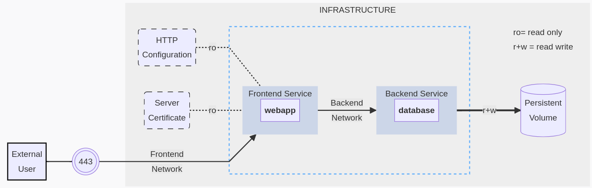

# Einstieg in Docker Compose


---

## Basics

- Docker Compose ist ein Tool zur **Definition und Ausführung** von **Multi-Container Docker-Anwendungen**.
- Es ermöglicht die **einfache Konfiguration mehrerer Container** und deren Interaktion.

---

# The spectrum of complexity



---

## Beispiel

```yaml
services:
  nginx:
    image: "nginx:latest"
    ports:
      - "8080:8080"
    volumes:
      - src:/code
  redis:
    image: redis
```

```bash
docker-compose up
```

---

## Wieso Docker Compose?

- Vereinfacht die **Orchestrierung** von mehreren Containern.
- **Declarative Syntax** erleichtert das Verwalten von Anwendungen.
- Ideal für Entwicklungsumgebungen und lokale Tests.

---

## YAML Basics

- Docker Compose-Konfigurationen werden in YAML (Yet Another Markup Language) definiert.
- YAML ist menschenlesbar und einfach zu schreiben.
- **Achtung auf die Einrückung (Indentation)** – YAML verwendet Einrückung zur Definition von Strukturen.
- Ähnliches Prinzip wie bei JSON
- Alle Felder haben einen Typ:
    - string
    - number
    - boolean
    - list
    - object

---

### JSON -> YAML Beispiel

```json
{
    "people": [
        {
            "fabio": {
                "name": "Fabio",
                "age": 27,
                "isTechstarterTeacher": true
            }
        }
    ]
}
```

```yaml
---
people:
- fabio:
    name: Fabio
    age: 27
    isTechstarterTeacher: true
```

---

## Grundlegende Struktur

- Eine `docker-compose.yml`-Datei enthält die **Anwendungskonfiguration**.
- Sie definiert Dienste (Services), Netzwerke und Volumes.
- Es gibt verschiedene [Versionen](https://docs.docker.com/compose/compose-file/compose-file-v3/)
- Die wichtigsten top-level Elemente sind:
    - `services`: Diese Services (Container) sollen erstellt werden
    - `volumes`: Diese Volumes / externe Daten sollen in Container eingebunden / persistiert werden
    - `networks`: Diese internen Netzwerke sollen erstellt werden
    - und weitere wie `configs` und `secrets`

---

### Beispiel 2



---

```yaml
services:
  frontend:
    image: awesome/webapp
    ports:
      - "443:8043"
    networks:
      - front-tier
      - back-tier

  backend:
    image: awesome/database
    volumes:
      - db-data:/etc/data
    networks:
      - back-tier

volumes:
  db-data: {}

networks:
  front-tier: {}
  back-tier: {}
```

---

## Images

- Im Service Block der Konfiguration kann man angeben, ob das Image **lokal gebaut oder aus der Registry gepulled** werden soll.
- Es ist also möglich mehrere Images nacheinander zu bauen

## Volumes

- Volumes ermöglichen die **persistente Speicherung von Daten zwischen Container-Instanzen**.
- Sie sind wichtig, um Daten zu speichern, die nach dem Beenden eines Containers erhalten bleiben sollen.
- Sie können entweder direkt im service block definiert werden oder unter dem top level key

---

## Netzwerke

- Docker Compose **erstellt automatisch ein Netzwerk für die Dienste**.
- Dies ermöglicht die **Kommunikation zwischen den Containern**.
- Benutzerdefinierte Netzwerke können für spezielle Konfigurationen erstellt werden.

---

## Wichtige Befehle

- `docker-compose up`: Startet die Anwendung
- `docker-compose up -d`: Startet die Anwendung im detached mode (im Hintergrund)
- `docker-compose down`: Stoppt die Anwendung
- `docker-compose logs`: Zeigt die Logs der Anwendung
- `docker-compose build`: Baut alle images
