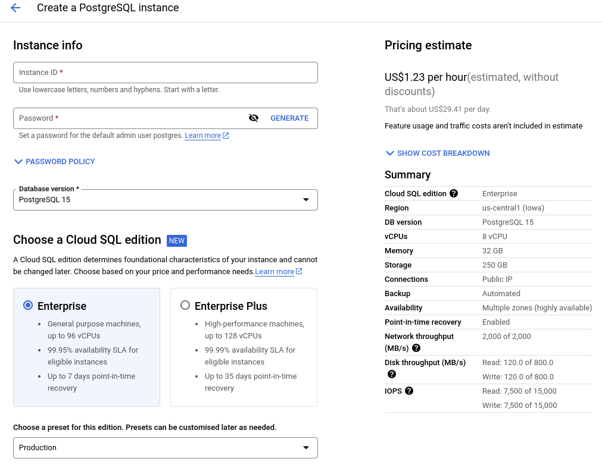

# Google Cloud Platform (GCP)

---

# Was ist die GCP?

- **Definition:** Google Cloud ist die Cloud-Computing-Plattform von Google, die eine umfangreiche Palette von Cloud-Services und -Lösungen für Unternehmen und Entwickler bereitstellt.

- **Angebote:** Google Cloud bietet eine breite Vielfalt an Diensten, darunter:

    - Computing
    - Speicher
    - Datenbanken
    - Künstliche Intelligenz (KI)
    - Maschinelles Lernen (ML)
    - Big Data
    - DevOps

---

---

# Unterschiede zu AWS?

- **Anbieter:** Google Cloud und AWS sind die beiden größten Cloud-Anbieter, aber sie haben unterschiedliche Schwerpunkte und Stärken.

- **Schwerpunkt:** Google Cloud hat einen besonderen Schwerpunkt auf Datenanalyse und maschinelles Lernen gelegt, weshalb es eine herausragende Wahl für datenintensive Anwendungen ist. AWS hingegen bietet eine breitere Palette von Diensten für verschiedene Anwendungsfälle.

- **Preisgestaltung:** Die Preisgestaltung in Google Cloud kann transparenter sein, und es gibt häufig innovative Preismodelle wie "Pay as you go" und Sustained Use Discounts, die dazu beitragen können, Kosten zu optimieren.

---

## AWS

- **Gestartet:** 2006

- **Services:** Über 200

- **Users:** Über 1 mio

- **Verbreitung:** Die meisten der Fortune 500 und über 90% der Fortune 100

---

## GCP

- **Gestartet:** 2008

- **Services:** Über 100

- **Users:** Über 1000 Firmen

- **Verbreitung:** Nicht so groß wie AWS aber Fokus auf Big Data

---

---

## Stärken von Google Cloud

- **Daten und KI:** Google Cloud bietet einige der besten Dienste für Datenverarbeitung, Big Data-Analyse, maschinelles Lernen und KI-Modelle. Google hat umfangreiche Erfahrung und Ressourcen im Bereich Daten und KI.

- **Globales Netzwerk:** Google verfügt über eines der weltweit größten und leistungsstärksten Netzwerke, was zu schnelleren Ladezeiten und zuverlässiger Konnektivität in der ganzen Welt führt.

- **Sicherheit:** Google Cloud ist bekannt für seine strenge Sicherheitskultur und bietet erweiterte Sicherheitsdienste wie Identity and Access Management (IAM), Sicherheitsüberwachung und DDoS-Schutz.

- **Serverlose Architektur:** Mit Diensten wie Google Cloud Functions können Entwickler serverlose Anwendungen erstellen und skalieren, ohne sich um die Verwaltung von Servern kümmern zu müssen.

---

# Wichtige Services (ähnlich wie bei AWS)

1. Compute Engine (EC2)
2. Cloud Storage (S3)
3. Cloud SQL (RDS)
4. IAM

---

# 1. Compute Engine (EC2)

- **Types:** General Purpose, Compute Optimized, Memory Optimized

- **Features:** Spot Instances, Encrypted Volumes, Auto Scaling Groups

---

# 2. Cloud Storage (S3)

- **Types:** Standard, Nearline, Coldline, Archive

- **Features:** Multi Region ist default

---

# 3. Cloud SQL (RDS)

- **Types:** MySQL, PostgreSQL, SQL Server 

- **Features:** Automated backups, Region Replication

---

# 4. IAM

- **User and Access Management**

- **Role based** nicht wie bei AWS Policy based

---

# Great / Unique Features

1. Spanner
2. Firebase
3. Big Query

---

# Spanner 

- Globale SQL Datenbank
- Unlimitierte Skalierungsmöglichkeiten
- PostgreSQL interface
- High Performance Query Processing

---

# Firebase

- Mobile Development Platform
- Integriert mit den meisten UI Frameworks (React, ...)
- Realtime DB
- Storage (Cloud Storage)
- User Management

---

# Big Query 

- Data Warehouse Solution
- OLAP (Online Analytical Processing) 
- Mit eingebauten ML/AI und BI Features
- Serverless

---

# Good to Know

- **Gliederung nach Projekten:** Um GCP zu nutzen muss ein Projekt angelegt werden

- **Aktivierung von APIs:** Für jeden Service der genutzt werden soll, muss erst die API aktiviert werden
