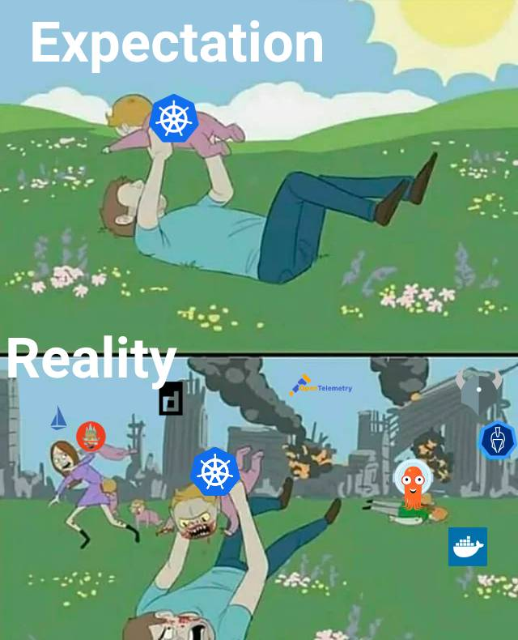

---

class: invert

---

# Einführung in Kubernetes


---



---

## Wieso braucht man Kubernetes?

---

- **Skalierbarkeit**:
    - Kubernetes erleichtert die Skalierung von Anwendungen, basierend auf ihrer Last und Anforderungen.
- **Automatisierung**:
    - Automatisiertes Deployment, Skalierung und Verwaltung von Container-Anwendungen.
- **Fehlerbehebung und Wiederherstellung**:
    - Schnelle Reaktion auf Ausfälle und effiziente Wiederherstellungsprozesse.
- **Effiziente Ressourcennutzung**:
    - Optimale Nutzung der Infrastruktur durch dynamische Verteilung der Ressourcen.

---

## Kurze Geschichte

---

- **Entwicklung**:
    - Ursprünglich von Google als Projekt namens "Borg" entwickelt.
- **Open-Source-Freigabe**:
    - 2014 von Google als Open-Source-Projekt veröffentlicht.
- **CNCF**:
    - Übernahme durch die Cloud Native Computing Foundation, die eine breite Community-Unterstützung und Entwicklung fördert.

---

## Microservices

---

- **Vorteile für Microservices**:
    - Kubernetes unterstützt die Microservices-Architektur durch Unabhängigkeit, Skalierbarkeit und leichte Verwaltung.
- **Dienstisolierung**:
    - Jeder Microservice kann unabhängig aktualisiert und skaliert werden.
- **Dienstkommunikation**:
    - Einfache Vernetzung und Kommunikation zwischen verschiedenen Diensten.

---

## Wichtige Bestandteile

---

- **Control Plane**:
    - Das Gehirn des Clusters, das für die Entscheidungsfindung und die Orchestrierung der Clusterknoten verantwortlich ist.

---

- **Kubelet**:
    - Eine auf jedem Knoten (Node) laufende Agent, die sicherstellt, dass die Container in einem Pod laufen.

---

- **API Server**:
    - Die zentrale Verwaltungsschnittstelle des Clusters. Dient als Kommunikationshub zwischen verschiedenen Teilen.

---

- **Scheduler**:
    - Verantwortlich für die Zuweisung von Pods zu Nodes basierend auf Ressourcenverfügbarkeit und Anforderungen.

---

- **etcd**:
    - Eine leichte und verteilte Key-Value Datenbank, die die gesamte Konfiguration und den Zustand des Clusters speichert.

---

## Ressourcen

---

### Pod

- Eine Gruppe von einem oder mehreren Containern, die auf demselben Host geteilt werden. Grundlegende Ausführungseinheit in Kubernetes.

```yaml
apiVersion: v1
kind: Pod
metadata:
  name: mein-pod
spec:
  containers:
  - name: mein-container
    image: nginx
```

---

### Replica Set

- Stellt sicher, dass eine spezifizierte Anzahl von Pod-Replikaten läuft. Nützlich für die Skalierung und Redundanz.
- Wrapper um die Pod Resource (spec inside spec)

---

```yaml
apiVersion: apps/v1
kind: ReplicaSet
metadata:
  name: mein-replicaset
spec:
  replicas: 3
  selector:
    matchLabels:
      app: mein-app
  template:
    metadata:
      labels:
        app: mein-app
    spec:
      containers:
      - name: mein-container
        image: nginx
```

---

### Deployment

- Ermöglicht die deklarative Aktualisierung von Pods und ReplicaSets.
- Wrapper um ein ReplicaSet

---

```yaml
apiVersion: apps/v1
kind: Deployment
metadata:
  name: mein-deployment
spec:
  replicas: 3
  selector:
    matchLabels:
      app: mein-app
  template:
    metadata:
      labels:
        app: mein-app
    spec:
      containers:
      - name: mein-container
        image: nginx
```

---

### Service

- Definiert einen logischen Satz von Pods und eine Politik, um auf sie zuzugreifen. Oftmals verwendet, um Netzwerkzugang zu Pods zu ermöglichen.

```yaml
apiVersion: v1
kind: Service
metadata:
  name: mein-service
spec:
  selector:
    app: mein-app
  ports:
    - protocol: TCP
      port: 80
      targetPort: 9376
```

---

### ConfigMap

- Erlaubt die Speicherung von Konfigurationsdaten außerhalb des Anwendungscode, die dann von Pods genutzt werden können.

```yaml
apiVersion: v1
kind: ConfigMap
metadata:
  name: meine-configmap
data:
  config.json: |
    {
      "key": "value"
    }
```

---

### Secret

- Benutzt, um sensible Daten wie Passwörter, OAuth-Token und SSH-Schlüssel zu speichern und zu verwalten.

```yaml
apiVersion: v1
kind: Secret
metadata:
  name: mein-secret
type: Opaque
data:
  password: dmFsdWU=  # base64-codiertes 'value'
```

---

## Weitere Punkte

---

- **Volumes**:

Ermöglicht die Speicherung von Daten in Pods, unabhängig vom Lebenszyklus des Containers.

---

- **Namespace**:

Ermöglicht die Trennung von Ressourcen in einem Cluster, was hilfreich ist, wenn mehrere Teams oder Projekte denselben Cluster verwenden.

---

- **Ingress**:

Managt den externen Zugriff auf die Services in einem Cluster, typischerweise HTTP.

---

- **Network Policies**:

Definiert, wie Gruppen von Pods miteinander und mit anderen Netzwerkendpunkten kommunizieren dürfen.

---

- **Helm**:

Ein Paketmanager für Kubernetes, der das Installieren und Verwalten von Kubernetes-Anwendungen vereinfacht.

---

- **Kubernetes Dashboard**:

Ein webbasiertes Benutzerinterface, das Informationen über den Zustand von Kubernetes-Ressourcen visualisiert und einfache Operationen ermöglicht.

