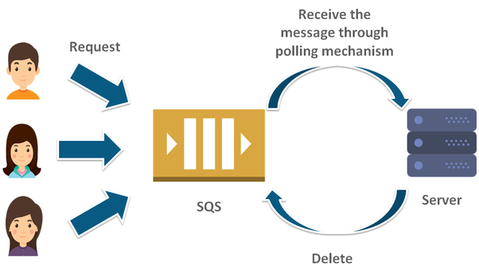
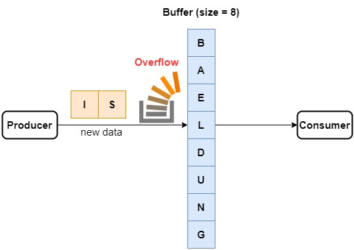
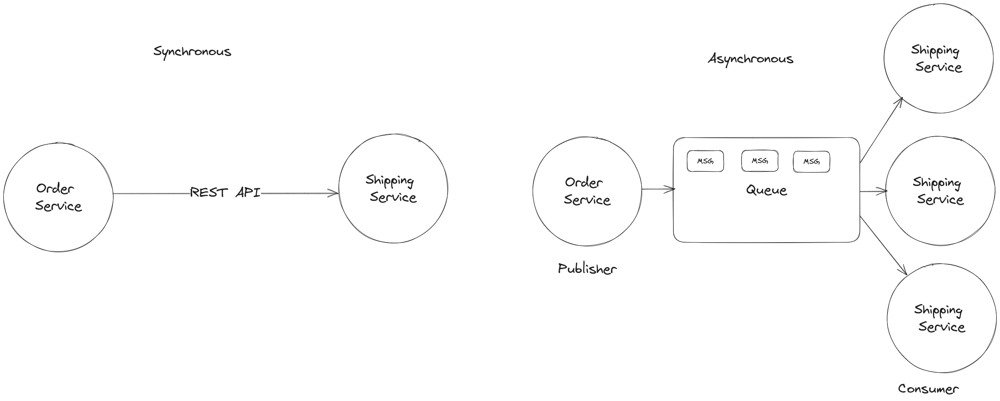

---

class: invert

---

# Simple Queue Service (SQS)

---

## Grundlagen

---

### SQS - Wieso?

- Entscheidender Dienst für die Umsetzung von Microservices-Architekturen
- Erleichtern der Kommunikation zwischen den verschiedenen Mikrodiensten 
- Hochgradige Entkopplung zwischen den Diensten
- Skalierbarkeit, Robustheit (Scalability, Durability)
- Vermittler zwischen den Services 
- **Services können sich unabhängig voneinander entwickeln, bereitstellen und skalieren**

---

### Welche Kommunikationsarten zwischen Services gibt es?

---

1. **In-Memory**: 
    - Services kommunizieren direkt miteinander, indem sie im selben Arbeitsspeicher oder Container ausgeführt werden.
    - Diese Methode ist **besonders schnell**
    - Eignet sich nur für Services, die auf derselben physischen Maschine oder im selben Container-Orchestrierungssystem arbeiten.

---

2. **HTTP Rest API Json**: 
    - Dies ist eine weit verbreitete Methode der Kommunikation zwischen Services.
    - Services nutzen das **HTTP-Protokoll**, um **RESTful API-Anfragen** zu senden und **JSON-Daten** auszutauschen.
    - Diese Methode ist plattformunabhängig und eignet sich gut für die Kommunikation über das Internet.

---

3. **Messaging Broker**:
    - Ein Messaging Broker ist eine spezialisierte Software, die als Vermittler zwischen den Services fungiert.
    - Services senden Nachrichten an den Broker, der sie dann an die Empfänger-Services weiterleitet.
    - Amazon SQS ist ein Beispiel für einen Messaging Broker-Dienst.

---

### Was bedeutet Buffering?

Buffering in Bezug auf Amazon SQS bezieht sich auf die Zwischenspeicherung von Nachrichten in Warteschlangen, bevor sie von den empfangenden Services verarbeitet werden.

---

#### Vorteile des Bufferings

- **Entkoppelt Services**: 
    - Die Verwendung von Queues zur Zwischenspeicherung von Nachrichten ermöglicht eine Entkopplung der Services.
    - Sie müssen nicht in Echtzeit kommunizieren und sind daher unabhängig voneinander.

---

- **Pufferung von Nachrichten**:
    - Nachrichten werden in der Warteschlange zwischengespeichert und sind für die Verarbeitung bereit.
    - Selbst wenn ein Service vorübergehend nicht verfügbar ist, gehen keine Nachrichten verloren.

- **Fehlertoleranz**:
    - Sollte ein Service vorübergehend ausfallen oder überlastet sein, können die Nachrichten in der Warteschlange aufbewahrt und zu einem späteren Zeitpunkt verarbeitet werden.

---

#### Nachteile des Bufferings

- **Verzögerung**: 
    - Aufgrund des Zwischenspeicherns von Nachrichten kann es zu einer gewissen Verzögerung bei der Nachrichtenübertragung kommen.

- **Ressourcenverbrauch**:
    - Das Puffern von Nachrichten erfordert Speicherplatz und Rechenressourcen.

---

## SQS

### Basics

---

### Queues

SQS bietet die Möglichkeit, Nachrichten in Warteschlangen (Queues) zu organisieren. Warteschlangen sind zentral für die Verarbeitung von Nachrichten zwischen Services.

- **FIFO vs. Standard**:
  - Amazon SQS bietet zwei Hauptarten von Warteschlangen: FIFO (First-In-First-Out) und Standard. 
  - FIFO-Warteschlangen garantieren, dass Nachrichten in der Reihenfolge, in der sie gesendet wurden, verarbeitet werden.
  - Standard-Warteschlangen hingegen bieten eine höhere Durchsatzrate, garantieren jedoch keine Reihenfolge der Nachrichtenverarbeitung. (At least once delivery)

---

### Publisher & Consumer

- Publisher-Consumer-Modell.
- Services senden Nachrichten in die Warteschlange (Publisher).
- Andere Services rufen Nachrichten aus der Warteschlange ab und verarbeiten (Consumer).

---

### Beispiel

Ein einfaches Beispiel zur Veranschaulichung der Verwendung von SQS:

- Angenommen, du hast zwei Microservices:
    - Order Service
    - Shipping Service
- Du könntest SQS verwenden, um die Kommunikation zwischen diesen beiden Services zu ermöglichen.
- Wenn ein Kunde eine Bestellung aufgibt, sendet der Order Service die Bestelldaten an eine SQS-Warteschlange.
- Der Shipping Service liest dann die Bestelldaten aus der Warteschlange, um die Versandvorbereitungen zu treffen.

---

---

### Visibility Timeout

- Ist die Zeitspanne, während der eine Nachricht nach dem Empfang von einem Consumer in der Warteschlange für andere Consumer unsichtbar ist.
- Dies verhindert, dass mehrere Services dieselbe Nachricht gleichzeitig verarbeiten.

---

### Message Attributes

- SQS ermöglicht die Verwendung von Nachrichtenattributen, die zusätzliche Metadaten zu Nachrichten hinzufügen.
- Diese Attribute können genutzt werden, um **Nachrichten zu filtern** und zu **organisieren**, sowie um spezifische Verarbeitungsinformationen bereitzustellen.

---

### Skalierbarkeit und Verfügbarkeit

- SQS ist **hoch skalierbar** und bietet eine **hohe Verfügbarkeit**. (Highly Scalable, Highly Available)
- Dies bedeutet, dass SQS auch bei wachsenden Anforderungen zuverlässig funktioniert. 
- Es ist redundant über mehrere Rechenzentren verteilt, was Ausfallsicherheit gewährleistet.

---

### Kosten

- SQS basiert auf einem **Pay-as-you-go-Modell**, bei dem du nur für die tatsächlich genutzten Ressourcen zahlst.
- Die Kosten hängen von der **Anzahl der Nachrichten** und der **Größe der Nachrichten** ab, die du verwendest.

---

### Sicherheit

- SQS ermöglicht die Authentifizierung und Autorisierung von Services und Benutzern, um sicherzustellen, dass nur autorisierte Entitäten auf die Warteschlangen und Nachrichten zugreifen können.
- Verschlüsselungsoptionen stehen ebenfalls zur Verfügung, um die Sicherheit der übertragenen Nachrichten zu gewährleisten.

