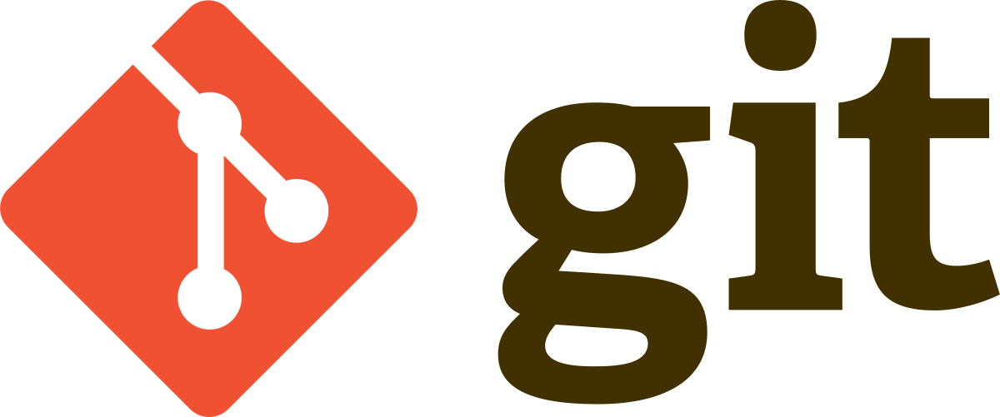
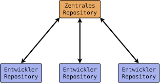
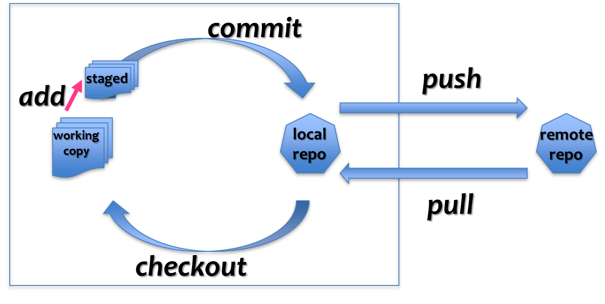

# Einführung in git

---

## Was ist git?

- Git ist ein verteiltes Versionskontrollsystem.
- Es ermöglicht das effiziente Verfolgen von Änderungen an Dateien und das Zusammenarbeiten in Projekten.
- Im vergleich zu anderen Versionskontrollsystem wird nicht jede Version neu gespeichert, sondern nur die jeweilige Differenz (diff)
- Git wurde von Linus Torvalds (auch Erfinder von Linux) entwickelt und ist heute das am weitesten verbreitete Versionskontrollsystem in der Softwareentwicklung.

> *You can do a lot of things with git, and many of the rules of what you \*should\* do are not so much technical limitations but are about what works well when working together with other people. So git is a very powerful set of tools.*   
**Linux Torvalds**

---

## Warum ist git wichtig?

- Git ermöglicht es, den Entwicklungsprozess zu verfolgen und Änderungen nachvollziehbar zu machen. (**Versionskontrolle**)
- Es erleichtert die Zusammenarbeit in Teams, indem es verschiedene Entwickler dazu befähigt, gleichzeitig an einem Projekt zu arbeiten.
- Git erleichtert das Zurücksetzen auf vorherige Versionen, das Verzweigen und Mergen von Code und das Beheben von Konflikten.
- Es bietet auch eine effiziente Möglichkeit, mit entfernten Repositories zu interagieren, wie z.B. GitHub oder GitLab.

---

### Git Local vs Remote Repo

---

## Grundlegende git-Konzepte

- **Repository (Repo):** Ein Repo ist ein Speicherort für dein Projekt und alle dazugehörigen Dateien und Versionen. Es enthält die gesamte Historie des Projekts.
    - Du kannst ein lokales Repo auf deinem Computer haben und es kann auch ein entferntes Repo auf einer Plattform wie GitHub geben.
    - Ein Repo kann aus verschiedenen Branches bestehen, die verschiedene Versionen des Codes repräsentieren.

- **Commit:** Ein Commit ist eine einzelne Änderung oder eine Sammlung von Änderungen an deinem Code. Er repräsentiert einen festen Zustand des Projekts zu einem bestimmten Zeitpunkt.
    - Commits werden mit einer aussagekräftigen Commit-Nachricht versehen, um die Änderungen zu beschreiben.

---

- **Branch:** Ein Branch ist eine Kopie des Codes in einem bestimmten Zustand. Er ermöglicht es dir, an neuen Funktionen oder Experimenten zu arbeiten, ohne den Hauptcode zu beeinflussen.
    - Du kannst neue Branches erstellen, Änderungen in ihnen durchführen und sie später in den Hauptcode (meistens als "master"-Branch bezeichnet) zusammenführen.

- **Merge:** Das Zusammenführen ist der Prozess, bei dem Änderungen aus einem Branch in einen anderen Branch übertragen werden. Dies geschieht normalerweise, um die Änderungen aus einem Feature-Branch in den Hauptcode zu integrieren.
    - Git kann automatisch Zusammenführungen durchführen, aber es können auch Konflikte auftreten, die manuell gelöst werden müssen.

---

### Für Remote Repos

- **Pull/Merge Request:** Ein Pull/Merge Request ist eine Aufforderung an andere Entwickler, deine Änderungen zu überprüfen und in den Hauptcode zu integrieren. Dies wird oft in Kombination mit Plattformen wie GitHub oder GitLab verwendet, um den Code-Review-Prozess zu vereinfachen.

---

## Grundlegender Workflow (Git Status)

- Es gibt verschiedene Zustände, die eine Datei für git haben kann:
    
    - **Untracked**: Die Datei ist nicht in der git Datenbank gespeichert
    - **Unmodified**: Die Datei ist erfasst und es hat sich nichts geändert. Alles Gut!
    - **Modified**: Die Datei ist erfasst, wurde aber seit dem letzten Commit geändert und noch nicht vorgemerkt
    - **Staged**: Die Datei ist erfasst, hat sich geändert und wurde zum commit vorgemerkt (zum staging hinzugefügt mit `git add`)

---

### Git Workflow Abbildung

---

## Git-Befehle

Hier sind einige grundlegende Git-Befehle, die dir den Einstieg erleichtern:

---

### Reposoitory anlegen:

- `git init`: Initialisiert ein neues git-Repo in deinem aktuellen Verzeichnis. Dies erstellt einen neuen leeren git-Repository.

- `git clone <Repo-URL>`: Erstellt eine lokale Kopie eines entfernten git-Repositorys. Du kannst die URL eines vorhandenen Repos angeben, um eine lokale Kopie des Codes herunterzuladen.

---

### Git Status Ändern

- `git add <Dateiname>`: Fügt eine Datei zu deinem Staging-Bereich hinzu, um sie für einen Commit vorzubereiten. Du kannst auch den Punkt (.) verwenden, um alle Änderungen hinzuzufügen.

- `git commit -m "<Commit-Nachricht>"`: Erzeugt einen neuen Commit mit den Änderungen im Staging-Bereich. Die Commit-Nachricht sollte beschreiben, was du geändert hast.

---

### Arbeiten mit Remote Repositories

- `git push`: Überträgt deine Commits in ein entferntes Repo. Wenn du lokale Änderungen gemacht hast, kannst du sie mit diesem Befehl auf ein entferntes Repository wie GitHub hochladen.

- `git pull`: Aktualisiert dein lokales Repo mit den neuesten Änderungen aus dem entfernten Repo. Dies lädt die neuesten Commits aus dem entfernten Repository herunter und führt sie mit deinem lokalen Code zusammen.

---

### Branches und Merging

- `git branch`: Zeigt eine Liste der Branches in deinem Repo an. Mit diesem Befehl kannst du sehen, welche Branches in deinem Repository vorhanden sind.

- `git merge <Branch-Name>`: Führt die Änderungen aus einem anderen Branch in deinen aktuellen Branch zusammen. Du gibst den Namen des Branches an, dessen Änderungen du zusammenführen möchtest.

---

### Monitoring und Status

- `git status`: Zeigt den aktuellen status an, also welche Dateien geändert wurden order noch nicht erfasst wurden.
- `git log`: Zeigt die Git-Historie an (welche Commits wurden im aktuellen Branch bereits getätigt).

---

Es gibt viele weitere Git-Befehle und Optionen, die du entdecken kannst. Die offizielle git-Dokumentation und Online-Ressourcen bieten weitere Informationen.

---

## Weitere Ressourcen:

- Schaue dir die Datei links.md an
