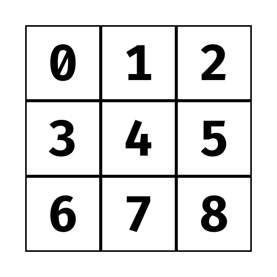

# Grundlagen der Spiele-Programmierung:

## Tic Tac Toe

- In diesem Beispiel wollen wir gemeinsam das bekannte Spiel Tic Tac Toe programmieren!
- Falls du das Spiel nicht kennst, spiele eine Runde unter folgendem [Link](https://g.co/kgs/Qxngfr)
- Falls du nicht weiter kommst, schaue dir das fertige Projekt im Ordner `game` an

## Regeln des Spiels:

## Let's get started

1. Erstelle den Projektordner: Öffne Visual Studio Code (stelle sicher, dass keine anderen Projekte geöffnet sind!) und erstelle folgende Projektstruktur:

- tic-tac-toe/
    - index.html
    - style.css
    - script.js

2. Füge den HTML-Grundgerüst-Code hinzu: Öffne die `index.html` Datei und füge folgenden Code ein:

```html
<!DOCTYPE html>
<html>
<head>
    <title>Tic Tac Toe</title>
    <link rel="stylesheet" href="style.css">
</head>
<body>
    <h1>Tic Tac Toe</h1>

    <div id="board"></div>

    <script src="script.js" defer></script>
</body>
</html>
```

3. Erstelle das CSS-Styling: In der `style.css`  Datei, füge folgenden Code ein:

- Im ersten Schritt stylen wir das Board (3 x 3 Grid), hierfür verwenden wir CSS Grid (lies dir [diesen Artikel](https://www.w3schools.com/css/css_grid.asp) durch, falls du grid noch nicht kennst)

```css
#board {
  display: grid;
  grid-template-columns: repeat(3, 1fr);
  grid-gap: 10px;
  width: 300px;
  margin-top: 20px;
}
```

- Nun können wir jede der Zellen stylen: 

    - Da der Content Anfangs leer ist, bekommt jede Zelle eine Höhe und Breite von 100px
    - Um den Text nach einem erfolgreichen Zug (X oder O) zu zentrieren, verwenden wir [CSS Flexbox](https://css-tricks.com/snippets/css/a-guide-to-flexbox/)

```css
.cell {
  width: 100px;
  height: 100px;
  background-color: lightgray;
  display: flex;
  align-items: center;
  justify-content: center;
  font-size: 48px;
  cursor: pointer;
}
```

4. Erstelle das Board: Füge den folgenden Code in der `script.js` Datei ein:

- Aktuell haben wir das eine fast leere HTML Seite ohne Board, das heißt jetzt geht es darum, das Grid mit JavaScript zu erzeugen. Die einzelnen Zellen speichern wir ein einem Array
- Jede der Zellen hat also ab sofort eine eindeutige Id nach folgendem Schema:




```javascript
const board = document.getElementById('board'); // Um die Zellen innerhalb des Board Elements anzuzeigen, brauchen wir eine Referenz
const cells = []; // In diesem Array werden alle Zellen Elemente gespeichert

function createBoard() {
    for (let i = 0; i < 9; i++) { // Wir brauchen 9 Zellen, also von 0 bis 8
        const cell = document.createElement('div'); // Erstelle ein neues Div -> Wird neue Zelle
        cell.classList.add('cell'); // Füge die cell CSS-Klasse hinzu, damit unser definiertes Styling angewendet wird
        board.appendChild(cell); // Die neue Zelle soll ein Child unseres Board-Divs sein (<div id="board">{Hier wird neue Zelle eingefügt}</div>)
        cells.push(cell); // Die neues Zelle wird in das cells Array gepusht (am Ende angehängt)
    }
}

createBoard(); // Die Funktion createBoard wurde zwar definiert aber wird hier aufgerufen
```

5. Erstelle die Spiel-Logik: Ändere die `script.js` Datei nach folgenden Vorgaben ab:

- Um das richtige Symbol (X oder O) darstellen zu können, müssen wir am Anfang der Datei eine Variable für den aktuellen Spieler erstellen:

```javascript
const board = document.getElementById('board');
const cells = [];

let currentPlayer = 'X'; // Speichert den Spieler, der aktuell am Zug ist

function createBoard() {
...
```

- Jetzt brauchen wir noch eine Funktion, die bei jedem Klick auf eine der Zellen ausgeführt wird (Event Handler)
- Dabei ist vorallem der Index der geklickten Zelle wichtig, deshalb wird dieser als Argument übergeben
- Füge folgende Funktion nach der `createBoard` Funktion ein

```javascript
function makeMove(index) {
    if (cells[index].textContent === '') { // Wenn die Zelle noch leer ist 
        cells[index].textContent = currentPlayer; // Füge das Zeichen des aktuellen Spielers ein
        if (currentPlayer === 'X') {
            cells[index].style.backgroundColor = 'lightblue'; // Player X bekommt lightblue Farbe
            currentPlayer = 'O'; // Im nächsten Zug ist O dran
        } else {
            cells[index].style.backgroundColor = 'lightcoral'; // Player O bekommmt lightcoral Farbe
            currentPlayer = 'X'; // Im nächsten Zug ist X dran
        }
    }
}
```

- Diese Funktion muss nun bei jedem Klick auf einem der Zellen ausgeführt werden, erstelle hierfür den Event Listener in der `createBoard` Funktion:

```javascript
function createBoard() {
    for (let i = 0; i < 9; i++) { // Wir brauchen 9 Zellen, also von 0 bis 8
        const cell = document.createElement('div'); // Erstelle ein neues Div -> Wird neue Zelle
        cell.classList.add('cell'); // Füge die cell CSS-Klasse hinzu, damit unser definiertes Styling angewendet wird
        board.appendChild(cell); // Die neue Zelle soll ein Child unseres Board-Divs sein (<div id="board">{Hier wird neue Zelle eingefügt}</div>)
        cells.push(cell); // Die neues Zelle wird in das cells Array gepusht (am Ende angehängt)

        // Füge diese Zeile ein!
        cell.addEventListener('click', () => makeMove(i)); // Wenn die Zelle geklickt wird, wird die makeMove Funktion aufgerufen
    }
}
```

5. Öffne das Spiel im Webbrowser: Jetzt funktioniert die Grundlegende Logik des Spiels, allerdings gibt es noch keine Überprüfung ob das Spiel zuende ist

6. Ändere den Code ab um zu überprüfen ob jemand gewonnen hat / das Spiel zuende ist:

- Zuerst müssen wir alle Züge auch in Variablen speichern (am Anfang der `script.js` Datei):

```javascript
const board = document.getElementById('board'); // Um die Zellen innerhalb des Board Elements anzuzeigen, brauchen wir eine Referenz
const cells = []; // In diesem Array werden alle Zellen Elemente gespeichert

let currentPlayer = 'X'; // Der aktuelle Spieler, der an der Reihe ist, wird hier gespeichert
let xMoves = [];
let oMoves = [];

function createBoard() {
... // Hier geht der restliche Code weiter
```

- Jetzt bei jedem Zug die Id der Zelle im jeweiligen Array speichern:

```javascript
function makeMove(index) {
    if (cells[index].textContent === '') { // Wenn die Zelle noch leer ist 
        cells[index].textContent = currentPlayer; // Füge das Zeichen des aktuellen Spielers ein
        if (currentPlayer === 'X') {
            cells[index].style.backgroundColor = 'lightblue'; // Player X bekommt lightblue Farbe
            currentPlayer = 'O'; // Im nächsten Zug ist O dran
            xMoves.push(index); // Speichere den Zug von X in das xMoves Array
        } else {
            cells[index].style.backgroundColor = 'lightcoral'; // Player O bekommmt lightcoral Farbe
            currentPlayer = 'X'; // Im nächsten Zug ist X dran
            oMoves.push(index); // Speichere den Zug von O in das oMoves Array
        }
    }
}
```

- Wir speichern alle möglichen Kombinationen um zu gewinnen in einem Array:

```javascript
const winningCombinations = [ // Alle möglichen Gewinnkombinationen
    // Reihen
    [0, 1, 2], // Erste Reihe
    [3, 4, 5], // Zweite Reihe
    [6, 7, 8], // Dritte Reihe

    // Spalten
    [0, 3, 6], // Erste Spalte
    [1, 4, 7], // Zweite Spalte
    [2, 5, 8], // Dritte Spalte

    // Diagonalen
    [0, 4, 8], // Erste Diagonale
    [2, 4, 6] // Zweite Diagonale
];
```

- Jetzt können wir eine weitere Funktion erstellen, die nach jedem Zug prüft ob das Spiel zuende ist (Gewinner oder Unentschieden)

```javascript
function gameFinished() {

    // Im folgenden checken wir, ob es einen Gewinner gibt
    // Dazu überprüfen wir, ob einer der Spieler 3 Symbole in einer Reihe hat
    // Dazu haben wir ein Array mit allen möglichen Gewinnkombinationen
    // Wir überprüfen, ob einer der Spieler 3 Züge in einer der Kombinationen hat

    for (let i = 0; i < winningCombinations.length; i++) {
        const combination = winningCombinations[i];
        if (combination.every((value) => xMoves.includes(value))) { // Überprüfe ob alle Werte der Kombination im xMoves Array sind
            finishGame('Player X hat gewonnen');
            return;
        }
        if (combination.every((value) => oMoves.includes(value))) { // Überprüfe ob alle Werte der Kombination im oMoves Array sind
            finishGame('Player O hat gewonnen');
            return;
        }
    }

    // Wenn es keinen Gewinner gibt, überprüfen wir, ob das Spiel unentschieden ist
    // Dazu checken wir, ob alle Zellen belegt sind, ergo insgesamt 9 Züge gemacht wurden
    // Wenn ja, ist das Spiel unentschieden
    const totalMovel = oMoves.length + xMoves.length;
    if (totalMovel === 9) {
        finishGame('Unentschieden');
        return;
    }

}
```

- Diese Funktion muss nun in jedem Zug aufgerufen werden:

```javascript

function makeMove(index) {
    if (cells[index].textContent === '') { // Wenn die Zelle noch leer ist 
        cells[index].textContent = currentPlayer; // Füge das Zeichen des aktuellen Spielers ein
        if (currentPlayer === 'X') {
            cells[index].style.backgroundColor = 'lightblue'; // Player X bekommt lightblue Farbe
            currentPlayer = 'O'; // Im nächsten Zug ist O dran
            xMoves.push(index); // Speichere den Zug von X in das xMoves Array
        } else {
            cells[index].style.backgroundColor = 'lightcoral'; // Player O bekommmt lightcoral Farbe
            currentPlayer = 'X'; // Im nächsten Zug ist X dran
            oMoves.push(index); // Speichere den Zug von O in das oMoves Array
        }
        // Diese Zeile einfügen!!
        gameFinished(); // Überprüfe ob das Spiel zuende ist
    }
}
```

- Im letzten Schritt müssen wir noch die `finishGame` Funktion erstellen, die am Ende des Spiels aufgerufen wird
- Das setTimeout liegt daran, dass HTML in einem Thread gerendert wird und somit nicht immer der letzte Spielzug angezeigt wird


```javascript
function finishGame(text) {
    setTimeout(() => {
        if(!alert(text)){window.location.reload();} // Wenn das Spiel zuende ist, wird eine Alert Box angezeigt und die Seite neu geladen
    }, 100);
}
```

Das war's! Du hast dein eigenes Tic Tac Toe-Spiel mit Vanilla JavaScript erstellt. Viel Spaß beim Spielen!
