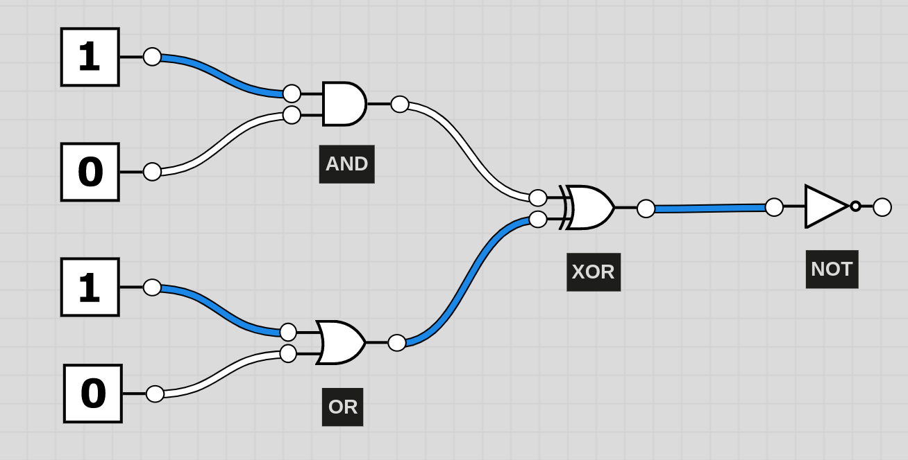
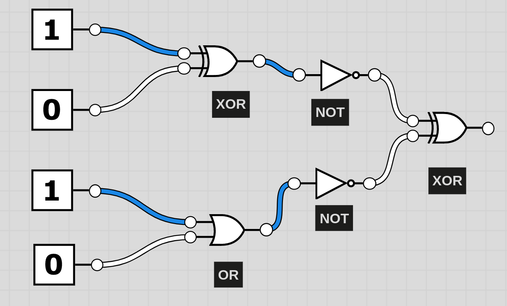

# Aufgabe 3: Boolsche Logik

Die Aufgaben basieren auf der Simulation, die auch schon in der Erklärung verwendet wurde.
Am Ende jeder Kette befindet sich eine Leuchte, welche bei einem True aufleuchtet.

Ziel ist es, herauszufinden was das Ergebnis der Kette ist.

1. Würde die Leuchte am Ender der Kette leuchten?

2. Würde die Leuchte am Ender der Kette leuchten?

