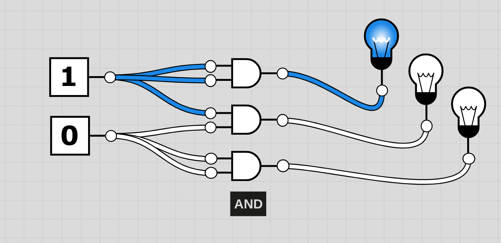

# Boolesche Logik: Eine Einführung

Erfahre in diesem Text die Grundlagen der booleschen Logik.

- Was ist boolesche Logik?
    - Boolesche Logik ist ein fundamentales Konzept in der Informatik, das auf den Ideen des Mathematikers George Boole basiert.
    - Sie beschäftigt sich mit der Verarbeitung und Manipulation von Informationen in digitalen Systemen.

- Boolesche Werte:
    - Boolesche Werte repräsentieren den Zustand "wahr" oder "falsch".
    - In der booleschen Logik werden sie oft mit den Werten 1 (wahr) und 0 (falsch) dargestellt.

- Boolesche Operatoren:
    - NOT-Operator:
        - Negiert einen booleschen Wert. Wenn der Eingangswert wahr ist, gibt er falsch zurück und umgekehrt.
    

    - AND-Operator:
        - Kombiniert zwei boolesche Werte. Er gibt wahr zurück, wenn beide Eingangswerte wahr sind, sonst gibt er falsch zurück.
    

    - OR-Operator:
        - Kombiniert zwei boolesche Werte. Er gibt wahr zurück, wenn mindestens einer der Eingangswerte wahr ist, sonst gibt er falsch zurück.
    

    - XOR-Operator:
        - Kombiniert zwei boolesche Werte. Er gibt wahr zurück, wenn genau einer der Eingangswerte wahr ist, sonst gibt er falsch zurück.
    

- Logische Ausdrücke:
    - Logische Ausdrücke bestehen aus booleschen Werten und booleschen Operatoren.
    - Sie werden verwendet, um komplexe Bedingungen in Programmierung und Schaltkreisen auszudrücken.

- Anwendungen der booleschen Logik:
    - In der Programmierung werden boolesche Ausdrücke verwendet, um Entscheidungen zu treffen und Bedingungen zu überprüfen. (! && ||)
    - In der Schaltkreistechnik werden boolesche Funktionen genutzt, um digitale Schaltungen zu entwerfen und zu steuern.

- Häufige Kombinationen: 
    - NAND-Operator:
        - Kombiniert AND und NOT
    - NOR-Operator:
        - Kombinier OR und NOT
    - XNOR-Operator:
        - Kombinier XOR und NOT
