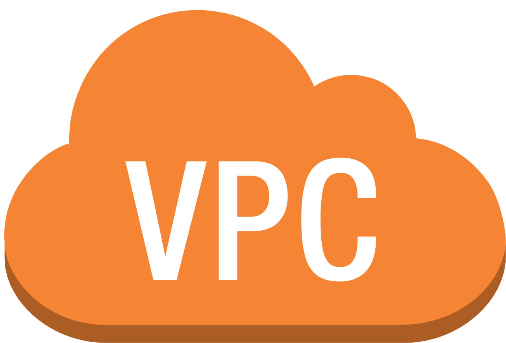
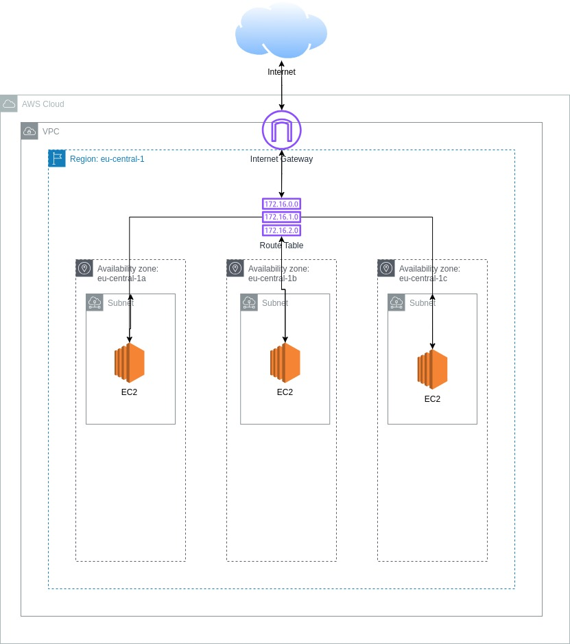

---

class: invert

---

# AWS Virtual Private Cloud (VPC) Wiederholung

---

## Was ist ein VPC?

- Ein **VPC (Virtual Private Cloud)** ist ein grundlegendes Konzept in der AWS-Cloud. Es stellt eine **virtuelle Netzwerkomgebung** bereit, in der wir unsere AWS-Ressourcen isolieren und betreiben können.
- Ein VPC ermöglicht es uns, ein **maßgeschneidertes Netzwerk** in der AWS-Cloud zu erstellen und zu konfigurieren, das unseren spezifischen Anforderungen entspricht.
- Mit einem VPC können wir **Ressourcen innerhalb des VPCs isolieren**, um Sicherheit und Kontrolle zu gewährleisten. Dies ermöglicht es uns, verschiedene Anwendungen und Umgebungen in separaten VPCs zu betreiben.

---

---

## Subnetze

- **Subnetze** sind Unterteilungen eines VPCs und dienen dazu, das VPC in kleinere Netzwerke zu segmentieren.
- In einem VPC können wir mehrere Subnetze erstellen, um Ressourcen in verschiedenen Teilen des Netzwerks zu platzieren.
- Subnetze können als **öffentliche oder private Subnetze** konfiguriert werden. Öffentliche Subnetze können Ressourcen direkt mit dem Internet verbinden, während private Subnetze nur eingeschränkten Zugang haben.

---

---

## Internet Gateway

- Ein **Internet Gateway** ist eine AWS-Ressource, die die Verbindung zwischen einem VPC und dem öffentlichen Internet herstellt.
- Wenn wir Ressourcen in einem VPC erstellen, die über das Internet erreichbar sein sollen, benötigen wir ein Internet Gateway.
- Ein Internet Gateway ermöglicht es Ressourcen in einem VPC, **Verbindungen zum Internet herzustellen und von dort aus Daten zu senden und zu empfangen.**

---

---

## Routing Table

- Die **Routing-Tabelle** im Zusammenhang mit einem VPC ist entscheidend für die Steuerung des Datenverkehrs innerhalb des VPC.
- Sie enthält Regeln, die den Datenverkehr zwischen Subnetzen und zum Internet leiten.
- Mit der Routing-Tabelle können wir festlegen, wohin der Datenverkehr geroutet wird, abhängig von der Ziel-IP-Adresse oder anderen Faktoren.

---

## Diese Resourcen sollen heute mit Terraform provisioniert werden!
